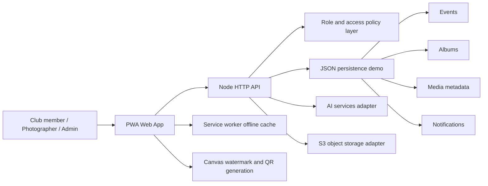

# Architecture

## Runtime Flow

1. The browser loads the PWA shell and asks `/api/bootstrap` for user-visible data.
2. The API identifies the current demo user from `X-User-Id`.
3. Role policies filter private events and media before sending data to the client.
4. Uploads are previewed in the browser, encoded for the demo, tagged, captioned, and stored through `/api/media`.
5. Social actions update media metadata and create notifications for owners or tagged users.
6. Face discovery posts a face token to `/api/face-match` and receives matching media.
7. Downloads render a watermarked image in browser canvas with club, event, and role metadata.

## Production Upgrade Path

- Replace JSON persistence with PostgreSQL or MongoDB.
- Replace data URL uploads with S3 multipart uploads and CloudFront delivery.
- Move tagging, duplicate detection, moderation, and face recognition behind async workers.
- Add WebSocket or Server-Sent Events for live notifications.
- Add JWT/OAuth authentication instead of the demo role switcher.
- Add a CI/CD workflow and Docker image for deployment.
